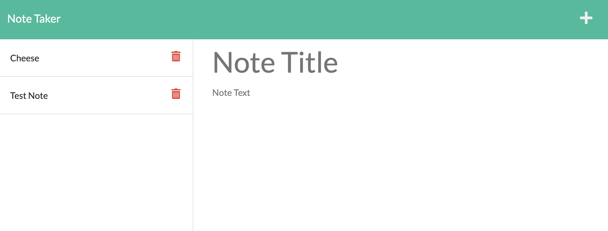

# Note Taker Starter Code

## User Story
AS A small business owner
I WANT to be able to write and save notes
SO THAT I can organize my thoughts and keep track of tasks I need to complete

## Description
An app that allows a user to take notes, save them, and delete them. They can view previously written notes, all of which include a header and main text. 

## Images

## Live URL
https://node-maker.herokuapp.com/notes

